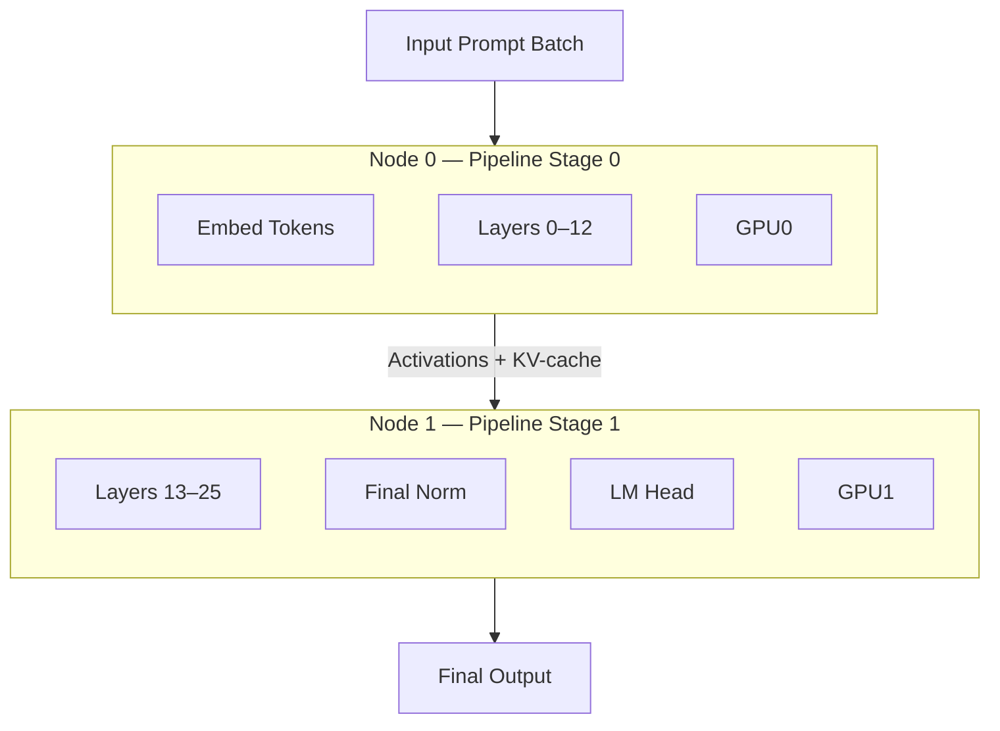

# Distributed Inference (v2):

## Overview
Many large language models are too large to fit on a single GPU, so even inference requires multi-GPU, multi-node execution.
This project implements and benchmarks a POC, using a small 3B model and a distributed inference pipeline using **PyTorch** with **DeepSpeed Inference** (which uses **NCCL** for GPU communication). The model we choose was [OpenLLaMA 3B v2](https://huggingface.co/openlm-research/open_llama_3b_v2), due to it's small size and permissive license.

### A note on the outcome
Ultimately, the distributed inference component could not be made to run successfully on the cluster, despite multiple attempts and several architectural redesigns. The combination of:
- single-GPU nodes (NVIDIA T4, 16 GB)
- the absence of NVLink
- aggressive offloading requirements due to limited storage
- and limitations in the Hugging Face / PyTorch weight-loading paths

Created a situation where the model partitions could not be reliably mapped to separate devices. These issues manifested as crashes during model construction (unassigned parameters, device-mapping failures, OOM errors, etc.), preventing the full pipeline from ever entering a runnable steady state.

Even though the final distributed execution was not achieved, the project served as a valuable learning experience, helping to illuminate the practical challenges of multi-node inference on resource-limited HPC systems. The work done here forms a solid foundation for a future iteration on a more appropriate multi-GPU cluster.

### Code Structure and Unused Components

You will notice that the repository contains several modules and scripts that never execute on the cluster itself. This is intentional. The original design of the project envisioned a full end-to-end workflow, where:
1. A job would be submitted remotely to Slurm
2. The cluster would run the multi-GPU inference pipeline
3. Results would be pulled back automatically
4. Metrics, visualizations, and scaling plots would be computed locally
5. Everything—from cluster run to graphs—would be reproducible from a single entry point.

Because the distributed runtime never became functional on the cluster, this “post-processing” portion of the pipeline never reached the execution stage. However, the code remains in the repository because it represents the full intended workflow and they still reflect the general architecture of the project. They will be directly useful once a working distributed runtime exists.

## Objectives
- Run OpenLLaMA v2 3B inference on 2 GPU nodes under **Slurm**.
- Measure "correctness" of the model through comparing a set of 20 prompts with a baseline 
- Measure strong and weak scaling (throughput / latency / efficiency) from 1 → 2 nodes.
- Conduct a batch size sweep to evaluate the parameter's affect (memory and throughput) 
- Quantize the model to explore the balance between performance and accuracy
- Profile compute vs. communication time using **INSERT HERE**.   
- Produce a short paper describing results and scaling limits.

## Tech Stack
- **PyTorch** — model runtime  
- **DeepSpeed Inference** — Pipeline parallelism  
- **NCCL** — GPU–GPU communication backend  
- **Slurm** — cluster scheduling  
- **Apptainer** — containerization  
- **sacct** — profiling and performance analysis


## Cluster Configuration
Our model will implement Pipeline Parallelism (PP) across nodes.

By doing so, we ensure the model fits within a node and we have a clean scaling axis. Our scaling experiments will go as follows:

  | Nodes | GPUs/node | TP | PP | Total GPUs |
  | ----- | --------- | -- | -- | ---------- |
  | 1     | 1         | 2  | 1  | 1          |
  | 2     | 1         | 2  | 2  | 2          |

*Note: If we had access to more GPU nodes, we would perform at least four iterations of the above*

### Cluster Topology:



## Quick Start
### Local pipeline (ignore for now):
```bash
git clone https://github.com/boris-gans/distributed-inference.git
cd distributed-inference
source .venv/bin/activate
pip install -r requirements.txt

# Default to --override and all variants with no limit (40 prompts - careful this is a lot of tokens)
python -m src.inference

# Override flag to skip parquet loading (if available) and re-construct all df's
python -m src.inference --override 

# No-override flag to load df's from parquet (if available) and skip df construction
python -m src.inference --no-override 

# Variant flag to load only 2k/4k prompts, limit flag to specify amount of prompts to load from each variant
python -m src.inference --override --variant=2k --limit=1
```

### On the cluster:
``` bash
# Install and authenticate HF cli first: https://huggingface.co/docs/huggingface_hub/main/en/guides/cli
hf download openlm-research/open_llama_3b --include="*" --local-dir models/

rsync -av \
  slurm \
  src/run_distributed_inference.py \
  <YOUR-USER>@hpcie.labs.faculty.ie.edu:/home/<YOUR-USER>/projects/def-sponsor00/<YOUR-USER>/distributed-inference

# Note: this will take a while and is about 6GB. Do this once per group, not user
rsync -av \
  models/openllama-3b \
  user49@hpcie.labs.faculty.ie.edu:/home/user49/scratch/group1/models/

# Note: I have the hostname configured in ~/.ssh/config to resolve hpcie for user49 at the real host
ssh hpcie 

export APPAINTER_IMAGE=/home/user49/projects/def-sponsor00/shared/images/pytorch-2.3.1-cuda11.8.sif
export PIPELINE_ROOT=/home/user49/scratch/group1/pipeline_run
export CODE_ROOT=/home/user49/projects/def-sponsor00/user49/distributed-inference
export APPTAINERENV_LD_LIBRARY_PATH=/usr/lib64:/usr/lib


sbatch ${CODE_ROOT}/slurm/submit.sbatch
```

Now that your job has been submitted, you can run the following to inspect / monitor it.

```bash
squeue -j <JOB-ID>

scontrol show job <JOB-ID>
```

To open the logs:
```bash
# Follow logs
tail -f /home/<YOUR-USER>/scratch/group1/hpc-runs/llama_pipeline-<JOB-ID>.out | ts
# Or for error messages
tail -f /home/<YOUR-USER>/scratch/group1/hpc-runs/llama_pipeline-<JOB-ID>.err | ts


# Or just see all (doesnt update)
cat /home/<YOUR-USER>/scratch/group1/hpc-runs/llama_pipeline-<JOB-ID>.out
# Or for error messages
cat /home/<YOUR-USER>/scratch/group1/hpc-runs/llama_pipeline-<JOB-ID>.err
```

Once the job has finished, pull the results back to your local workstation:
```bash
# First ensure ALL logs/info are outside the cluster (per-rank logs aren't binded); do this on the cluster
cp -r /tmp/workspace/outputs ${SCRATCH_ROOT}/pipeline_run/outputs

# Then locally:
rsync -avz --progress \
    <YOUR-USER>@hpcie.labs.faculty.ie.edu:${SCRATCH_ROOT}/pipeline_run/outputs \
    ./outputs
```


## Execution Flow
1) **Local step** — dry-run `python -m src.inference --local_debug` to verify configs/prompts and capture reference outputs.  
2) **Cluster step** — Follow the above steps to upload the code and the model to the cluster (if needed) and run the batch job.
3) **Result sync** — pull `${EXPERIMENT_ROOT}/outputs` (rank logs, completions, profiler traces if enabled) back to your local workstation.  
4) **Post-process** — run the analysis notebook/script to compute metrics across the four experiments; include the local reference outputs when comparing correctness.

## Experiments to Run
- **Strong scaling** — fix total tokens/prompts, vary nodes/GPUs to measure speedup.  
- **Weak scaling** — grow workload with resources so per-GPU load stays constant.  
- **Sensitivity sweep** — sweep one parameter (batch size, preconditioner setting, or partitioning choice) to expose stability/efficiency trends.  
- **Optimization** — apply one change that measurably improves time or throughput (e.g., caching, fused kernels, better partitioning) and rerun the baseline config.

## Metrics Captured (each experiment)
- Wall-clock time (job elapsed), throughput (tokens/sec or prompts/sec), and parallel efficiency.  
- Resource use (GPU/CPU util + memory), I/O time, communication time, and preprocessing cost.  
- Keep profiler outputs (`nsys`/`perf` if enabled), `sacct` accounting, and the per-rank logs for traceability.

## Outputs
- Structured metrics bundle per run (CSV/JSON) with the values above.  
- Plots/tables comparing strong vs. weak scaling, the sensitivity curve, and the optimization delta.  
- Notes on correctness deltas between local and cluster outputs (manual spot checks only).


## Cluster File Structure

```
Host prep (before sbatch)
/home/<USER>/projects/def-sponsor00/<USER>/distributed-inference   # CODE_ROOT synced from laptop (slurm/, src/run_distributed_inference.py)
/home/<USER>/scratch/group1/pipeline_run                          # SCRATCH_ROOT/PROJECT_ROOT/PIPELINE_ROOT (shared runtime data)
├── exp_config.json                                               # copied from CODE_ROOT/slurm at submit time
├── ds_config.json                                                # copied from CODE_ROOT/slurm at submit time
├── prompts.jsonl                                                 # copied from CODE_ROOT/slurm at submit time
└── outputs/                                                      # initially empty; Slurm stdout/err go to ${SCRATCH_ROOT}/hpc-runs
/home/<USER>/scratch/group1/models/openllama-3b                   # model snapshot reused by all nodes
/home/<USER>/projects/def-sponsor00/shared/images/pytorch-2.3.1-cuda11.8.sif  # APPAINTER_IMAGE (or ${SCRATCH_ROOT}/appainter/appainter.sif)

Container view during the job (binds set in slurm/submit.sbatch)
/app/                        -> ${CODE_ROOT} (src/run_distributed_inference.py, slurm/run.sh)
/tmp/workspace/              -> ${SCRATCH_ROOT}/pipeline_run
├── exp_config.json
├── ds_config.json
├── prompts.jsonl
├── outputs/
│   ├── rank_0.log, rank_1.log
│   ├── completions_rank_0.jsonl, completions_rank_1.jsonl
│   ├── sacct_<jobid>.txt (if sacct is available)
│   ├── nsys_rank_<r>.* or perf_rank_<r>.txt (when PROFILER is set)
│   └── other per-rank stdout from run.sh
├── hf_cache/                # Hugging Face cache populated at runtime
├── .venv/                   # runtime Python deps installed by slurm/run.sh
├── .pip-cache/, .triton-cache/
└── (any ad-hoc configs you add under ${PIPELINE_ROOT})
/workspace/models/openllama-3b -> ${SCRATCH_ROOT}/models/openllama-3b
```


## Resources
**Model:** [OpenLLaMA 3B v2](https://huggingface.co/openlm-research/open_llama_3b_v2)

**Docs:**
-   [Apptainer 1.35](https://apptainer.org/docs/user/1.3/)
-   [Pytorch 2.3.1](https://docs.pytorch.org/docs/2.3/)
-   [CUDA 12.2.1](https://docs.nvidia.com/cuda/archive/12.2.1/)
-   [DeepSpeed 0.14.4](https://deepspeed.readthedocs.io/en/stable/)